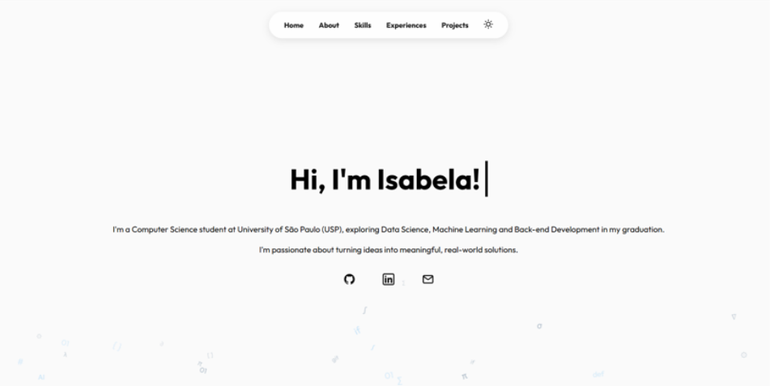

# Isabela Aoki - Personal Website


A personal portfolio website developed for the **MAC0102** course. The website serves as a landing page to present my background, skills, experiences, and projects in a clean and responsive interface.

## ✨ Features

* Responsive design for desktop and mobile devices
* Dark mode support
* Bilingual interface (English and Brazilian Portuguese)
* About Me section
* Skills section
* Education and Experience timeline
* Projects showcase
* Contact information

## 🚀 Live Demo

```text
https://isaaoki.github.io/personal-website
```

## 📸 Screenshots

### Home Page




## 🛠️ Technologies Used

* HTML
* CSS
* JavaScript
* GitHub Pages

## 📂 Project Structure

```text
.
├── README.md
├── index.html
└── assets
    ├── css
    │   └── styles.css
    ├── images
    └── js
        └── main.js
```

## 💻 Running Locally

Since this is a static website, simply clone the repository and open `index.html` in your browser.

```bash
git clone https://github.com/isaaoki/personal-website.git
```

Then open:

```text
index.html
```

Alternatively, you can use a local server extension such as Live Server in VS Code.

## 🎓 Academic Context

This project was developed as part of the **MAC0102** course and was designed to apply concepts related to web development, user interface design, and responsive layouts — as well as document the path I intend to follow during my college years.

## 🙏 Credits

Developed by **Isabela Aoki**.

Icons and visual assets belong to their respective owners.

## 📄 License

This project is available for educational and portfolio purposes.
